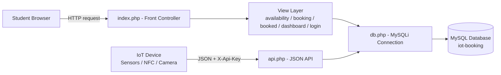
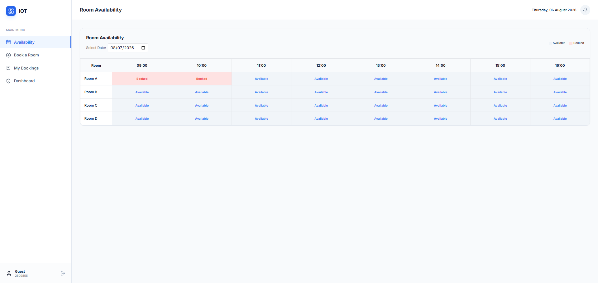
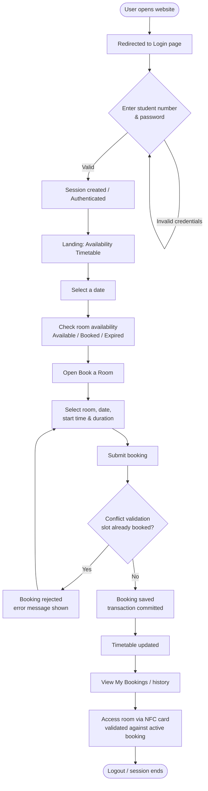

# 🔐 IoT Discussion Room Booking System


A full-stack web application for a university **IoT assignment** that lets students reserve discussion rooms online while monitoring **real-time room availability** through an interactive timetable interface.

---

## 📑 Table of Contents

1. [Project Description](#2-project-description)
2. [Features](#3-features)
3. [Technologies Used](#4-technologies-used)
4. [System Architecture](#5-system-architecture)
5. [Database](#6-database)
6. [Project Structure](#7-project-structure)
7. [Installation Guide](#8-installation-guide)
8. [Usage Guide](#9-usage-guide)
9. [Screenshots](#10-screenshots)
10. [Future Improvements](#11-future-improvements)
11. [License](#12-license)
12. [Author](#13-author)
13. [Appendix: System Workflow](#14-appendix-system-workflow)

---

## 2. Project Description

In a busy campus environment, discussion rooms are a scarce resource. Traditionally, students reserve them manually — a process that is slow, error-prone, and offers no visibility into which rooms are actually free.

This project replaces that manual workflow with a **centralized, IoT-enhanced booking platform**:

- Students sign in and view a **live timetable** showing which discussion rooms are available, booked, or already expired for any date.
- Bookings are created in seconds with **built-in conflict prevention**, so a room can never be double-booked.
- The system is wired into an **IoT setup** (sensors + NFC): environmental conditions (temperature, humidity, system status) are reported from each room, and a student's **NFC card** can be validated against their active booking to grant room access.

The result is a faster, fairer, and more transparent booking experience that removes the guesswork and manual coordination from reserving a discussion room.

---

## 3. Features

> ✅ = fully implemented & verified in the source code

- ✅ **Student authentication** — session-based login using a student number and password (`login.php`). Accounts are provisioned in the database (no public self-registration).
- ✅ **Interactive availability timetable** — a room × timeslot grid for any selected date, colour-coded as **Available**, **Booked**, or **Expired** (`availability.php`).
- ✅ **Discussion room booking** — pick a room, date, start time, and a **1 or 2 hour** duration (`booking.php`).
- ✅ **Double-booking prevention** — bookings are validated inside a DB transaction before insert **and** protected by a `UNIQUE(room_id, timeslot_id, booking_date)` constraint.
- ✅ **Booking management / history** — a "My Bookings" page lists the logged-in student's reservations with **Active/Expired** status badges; expired bookings are cleaned up automatically (`booked.php`).
- ✅ **Admin / overview dashboard** — a read-only dashboard showing all system bookings plus **real-time room conditions** (temperature, humidity, and system status with "updated X ago" timestamps) from sensor logs (`dashboard.php`).
- ✅ **IoT sensor data ingestion** — a JSON API endpoint (`POST /api/report-data`) that records temperature, humidity, distance, and system status from each room.
- ✅ **NFC room-access validation** — `POST /api/parse-nfc` verifies a student's NFC card against an active booking for the room and grants/denies access.
- ✅ **Webcam picture command** — `POST /api/take-picture` queues a picture capture command for the room's IoT device.
- ✅ **API key authentication** — all IoT API endpoints require a shared key in the `X-Api-Key` header.
- ✅ **Responsive UI** — a modern Tailwind CSS interface with the Inter font and Lucide icons, adapting from mobile to desktop.

---

## 4. Technologies Used

| Layer | Technology |
| --- | --- |
| **Frontend** | HTML5, Tailwind CSS 3 (CDN), Lucide Icons (CDN), Google Fonts (Inter) |
| **Backend** | PHP 8 (native, no framework), MySQLi, PHP sessions, JSON REST API |
| **Database** | MySQL / MariaDB |
| **IoT Integration** | JSON API endpoints for sensor reporting, NFC card validation, and picture commands |
| **Tooling** | phpMyAdmin (schema export), Git, Visual Studio Code |

---

## 5. System Architecture

The application uses a **front-controller pattern**:



- **Routing** — every request is sent to `index.php`, which inspects the URL path and includes the matching view file inside a shared layout (`partials/sidebar.php`, header, icons).
- **Data access** — views and API handlers use a shared MySQLi connection (`db.php`) with prepared statements.
- **IoT bridge** — hardware devices (e.g., Raspberry Pi / ESP32) authenticate with an API key and talk to `api.php`, which writes sensor logs to the database and validates NFC access against bookings. The browser never exposes this API key.
- **Sessions** — the server manages student identity with PHP sessions; protected views redirect unauthenticated users to `/login`.

---

## 6. Database

The schema lives in `iot-booking.sql` and consists of five tables:

| Table | Purpose |
| --- | --- |
| `students` | Registered users — `student_id`, `name`, `student_number` (unique), `password` |
| `rooms` | Discussion rooms — `room_id`, `room_number`, `capacity` |
| `timeslots` | Fixed hourly time windows (09:00 – 17:00) — `timeslot_id`, `start_time`, `end_time` |
| `bookings` | A student's reservation of a room + timeslot on a date, with an `Active`/`Expired` status and check-in/out timestamps |
| `sensor_logs` | IoT readings per room — temperature, humidity, distance, system status, and timestamp |

Key design points:

- **Conflict prevention** — `bookings` has a composite `UNIQUE(room_id, timeslot_id, booking_date)` index, making double booking impossible at the database level.
- **Integrity** — foreign keys cascade deletes from `students`, `rooms`, and `timeslots` into `bookings`.
- **Multi-slot booking** — a 2-hour booking inserts two consecutive `bookings` rows, which are merged when displayed.

---

## 7. Project Structure

```
IOT-Room-Booking/
├── index.php          # Front controller: routing, auth guard, shared layout
├── login.php          # Login page + session authentication logic
├── availability.php   # Interactive room × timeslot availability timetable
├── booking.php        # New booking form + conflict-validated booking logic
├── booked.php         # "My Bookings" history with auto-expiry
├── dashboard.php      # Admin overview: all bookings + real-time room conditions
├── api.php            # IoT JSON API (report-data, parse-nfc, take-picture)
├── db.php             # MySQLi database connection
├── iot-booking.sql    # Database schema + seed data
├── partials/
│   └── sidebar.php    # Shared sidebar navigation
└── .gitattributes
```

---

## 8. Installation Guide

### Prerequisites

- PHP **8.x** with the `mysqli` extension
- MySQL **5.7+** or MariaDB (e.g., via XAMPP)
- A web server (Apache/XAMPP) or the PHP built-in server

### Step 1 — Clone the repository

```bash
git clone https://github.com/your-username/iot-room-booking.git
cd iot-room-booking
```

### Step 2 — Configure the database

1. Start your MySQL server (e.g., via XAMPP's Control Panel).
2. Open **phpMyAdmin** and create a database named `iot-booking`.
3. Import the schema: `Import` → select `iot-booking.sql` → `Go`.
   - This creates all tables and seeds the demo room/timeslot/sensor data.

### Step 3 — Configure the database connection

Edit `db.php` to match your local environment:

```php
$conn = mysqli_connect('localhost', 'root', '', 'iot-booking');
```

> Adjust the host, username, and password if they differ from the defaults (`localhost` / `root` / empty).

### Step 4 — Serve the project

**Option A — PHP built-in server** (clean URLs need the router script):

```bash
php -S localhost:8000 index.php
```

**Option B — Apache / XAMPP**

- Copy the project into `htdocs/iot-room-booking`.
- Add rewrite rules so all requests route through `index.php` (e.g., an `.htaccess` that forwards everything to `index.php`), because the app uses clean URLs like `/login` and `/availability`.

### Step 5 — Verify

Open `http://localhost:8000` (or `http://localhost/iot-room-booking/`) — you should be redirected to the login page.

### Seeded test account

| Student Number | Password |
| --- | --- |
| `2509855` | `Junk#0512` |

---

## 9. Usage Guide

1. **Sign in** — open the login page and enter your student number and password. You'll be taken to the availability timetable.
2. **View availability** — pick a date to see each room × timeslot. Cells are green-ish *Available*, red *Booked*, or grey *Expired*.
3. **Book a room** — go to **Book a Room**, choose the room, date, start time, and a 1 or 2 hour duration, then click **Confirm Booking**.
4. **Conflict handling** — if the slot was already taken, the system rejects the booking with an error message; otherwise it's saved and you're redirected to **My Bookings**.
5. **Manage bookings** — **My Bookings** lists your reservations with their current status. Past bookings are automatically marked *Expired*.
6. **Room access (IoT)** — tap your NFC card at the room; the system validates it against an active booking and unlocks the door if it's valid.
7. **Sign out** — use the logout button in the sidebar to end your session.

---

## 10. Screenshots

### Availability Timetable


### Booking Page


### My Booking


### Dashboard


---

## 11. Future Improvements

- 🔐 **Password hashing** — replace plaintext password comparison with `password_hash()` / `password_verify()`.
- 📝 **Self-registration** — let students create accounts and reset passwords without admin involvement.
- 👥 **Role-based access** — restrict the dashboard to an actual admin role instead of all logged-in users.
- 🔔 **Notifications** — email or in-app reminders before a booking starts.
- ⏱️ **Real-time updates** — use polling or WebSockets so the timetable and sensor cards refresh without manual page reloads.
- 🔑 **Configurable API key** — move the hardcoded API key into an environment variable or config file.
- 📊 **Usage analytics** — charts of room occupancy, peak hours, and booking trends.

---

## 12. License

Distributed under the **MIT License**. See `LICENSE` for more information.

---

## 13. Author

**Your Name** — [your-github](https://github.com/your-username) · [your-email@example.com](mailto:your-email@example.com)

*Built as an IoT assignment for university coursework.*

---

## 14. Appendix: System Workflow

The diagram below illustrates the complete end-to-end flow of the system, from login to booking and room access.


